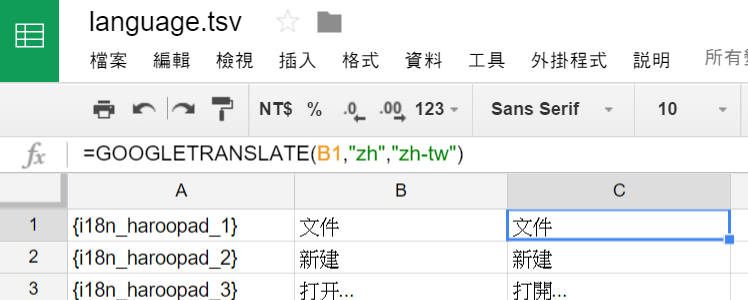

#Haroopad繁體中文介面
#####Haroopad in Traditional Chinese

是不是正在因為Haroopad一載下來就是簡體中文而感到困擾呢?

現在你只要花不到一分鐘，就可以把你Haroopad的介面改成繁體中文喔!

##Usage
1. 點選右上角的`Download ZIP`下載整個zip檔
2. 解壓縮
3. 在資料夾裡面執行:

	```
	> java ZhTranslate
	```

    它會自動尋找預設安裝Haroopad的路徑，你也可以自己給 haroopad.exe 所在的路徑當作參數，for example：

    ```
	> java ZhTranslate "C:\Users\<Username>\AppData\Roaming\Haroo Studio\Haroopad"
	```

4. 重新啟動 Haroopad
5. Nice!

####補充說明
- 若不給路徑參數的話，會依作業系統去找系統預設AppData的路徑
- 如果還是找不到或是你根本沒有安裝在預設的路徑底下的話，就請自己給路徑參數
- 路徑參數要是`haroopad.exe`所在的那個資料夾
- 因為`Haroo Studio`資料夾名稱有空格，所以記得給參數要加引號

##Folder
以下是給有興趣想看 source code 的人看的，如果你只是要繁體中文的 Haroopad 話可以開始 Download ZIP 了!
#####src
- 恩，裡面就是存source code的資料夾

#####zh
- 裡面存著原本存在於應用程式底下簡體中文的四個json檔

#####langs
- 存有繁簡轉換對照表的 tsv 檔
- 還有暫時把簡體中文轉換成`{i18n_haroopad_XXX}`的json檔

#####out
- 裡面是存轉換成繁體中文的 json 檔

#####zh-tw
- 這裡也存了最後轉換成繁體中文的 json 檔
- 跟`out`資料夾裡面的差別是有些大陸用語手動把它修改掉

##Source Code
#####GetZhContent.java
- 讀取`zh`資料夾裡面的 json 檔，並用 Regular Expression 讀出這些 json 物件 value 為字串的部分
- 將這些字串用`{i18n_haroopad_XXX}`取代，為了將來要把繁體中文取代近來
- 把剛剛抓出的字串存成一個`language.tsv`準備做成繁簡中文的對照表

#####TranslateToZhTW.java
- 將`langs\language_zh_tw.tsv`讀出並用 map 存成對照表
- 讀取`langs`資料夾裡面的 json 檔並使用字串取代
- 取代完的檔案存到`out`資料夾裡面

#####ZhTranslate.java
- 找到系統預設的AppData資料夾並檢查裡面是否有Haroopad
- 找到應用程式中存放中文文字的`zh`資料夾
- 把裡面的檔案換成`zh-tw`裡面的json檔

####補充說明
- 因為 google translate 的 API 好像要$$$，然後網路上查的其他繁簡轉換的 API 也都是用個文字轉換表，所以乾脆自己來做繁簡轉換表 (也就是`language_zh_tw.tsv`)
- 把簡體字抓出來存在`language.tsv`然後把這張表丟到 google 試算表就可以用`=GOOGLETRANSLATE(B1,"zh","zh-tw")`來把存在 B1 那格的文字從簡體轉成繁體

- 上面那個檔案從 google 試算表載下來存成`language_zh_tw.tsv`
- 以上整件事情 excel 應該也做得到吧(?)
- 因為抓出來的有些文字含有逗號，所以存 .tsv 檔不存 .csv 檔
- 執行完畢之後原本簡體字的檔案並不會被刪除，而是會在原本的資料夾裡面被重新命名成前面加一個底線，所以哪天突然想要回到簡體字的懷抱的話只要把複製過去的json檔刪除再把有底線的檔名還原就好了


